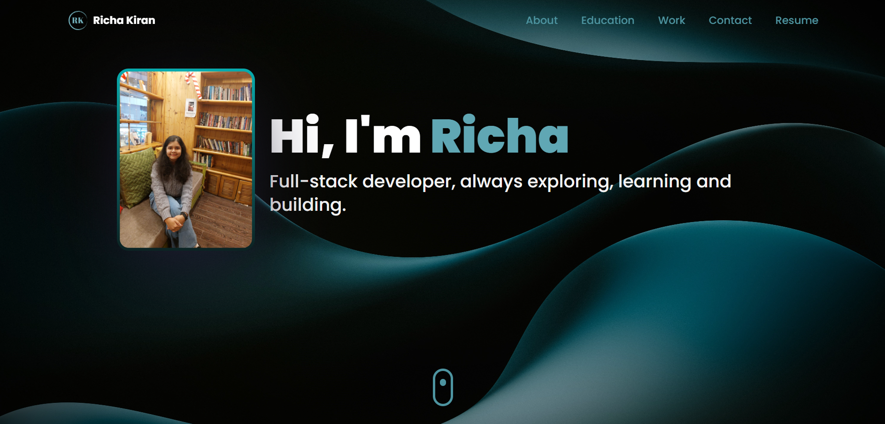

# My Portfolio

Welcome to my Portfolio!
This portfolio website showcases my projects, experience and skillset. This website has been made using ThreeJS(3D Graphics Library on), Framer Motion for the animations and transitions in React and TailwindCSS(CSS Styling framework).

## Components

The website includes the following sections:

### 1. Introduction Section

The section features an introduction about myself along with a display picture, as well as a visually pleasing background that complements the overall theme of the site. Down below I've used a slider button animation which will take you to the next section.

### 2. About Section

In this section I've given an overview about myself and what I'm interested in. I've used Tilt effect in ReactJS to make the cards appear 3D and nice.

### 3. Academic Milestones

Here I've added my academic background.

### 3. Experience Section

Next, I've added an experience section to tell the viewers about my experience in the software industry, the various roles and companies I've worked for. It uses React's vertical timeline component to give it a reponsive timeline like effect.

### 4. Skills Section

This section consists of the technical skills that I've worked on and excelled at through the years. I've used Ball Graphics created using React Three Fiber.

### 5. Projects

This sections shows the major projects I've worked on. This contains cards with React's Tilt effect.

### 6. Certifications Section

Then we have a certification section showcasing all the certifications I have, also using React's Tilt effect on cards.

### 7. Contact Section

Finally, there is a contact section designed with a beautiful threejs globe graphic, to reach out to me on different social media platforms like Instagram, LinkedIn, Twitter or Email.

and that's a wrap! Thank you for visiting!✨
